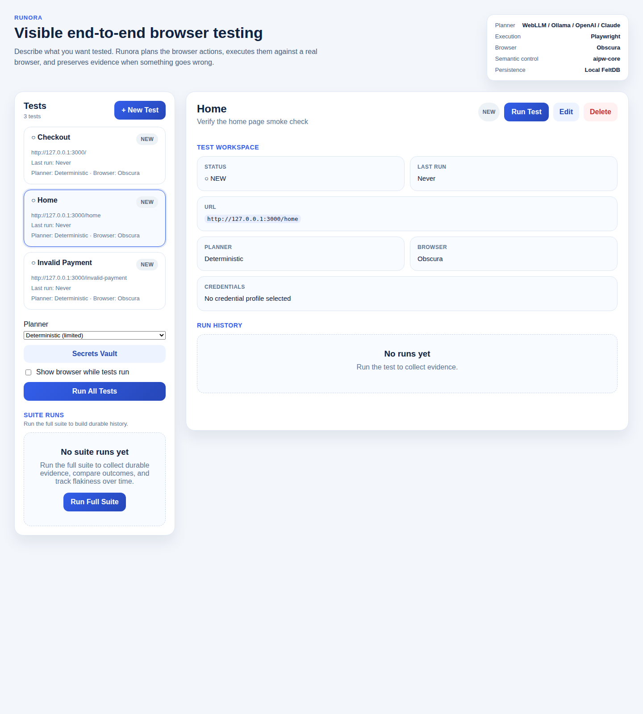
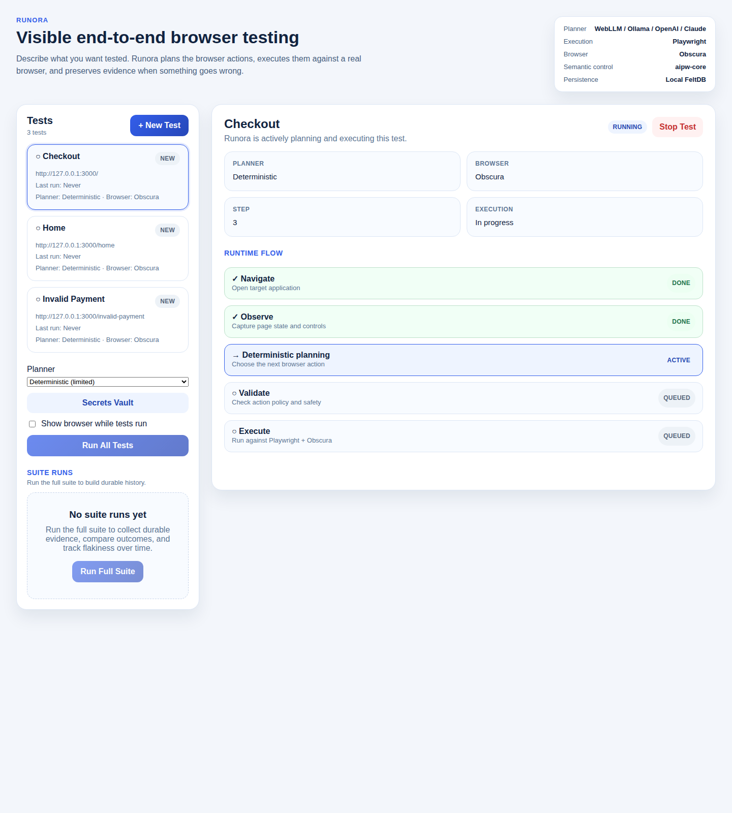
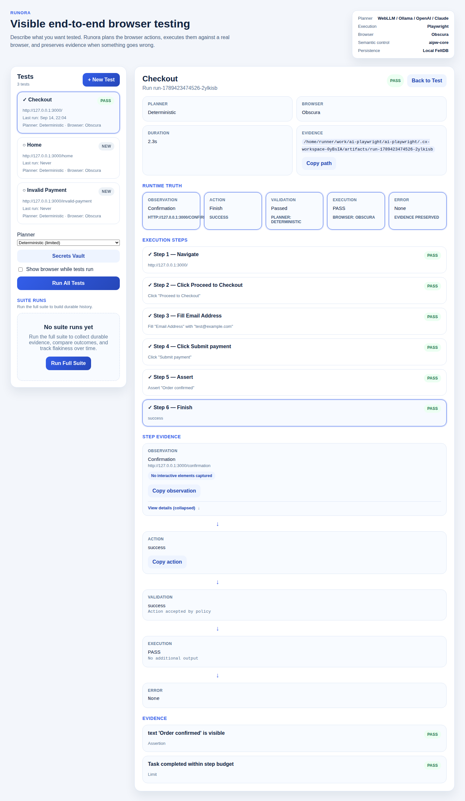
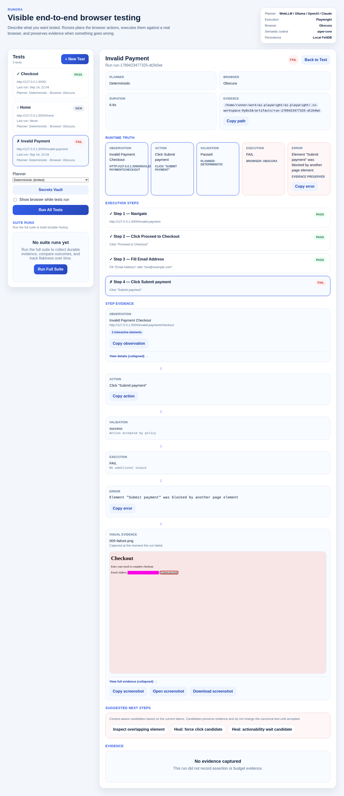
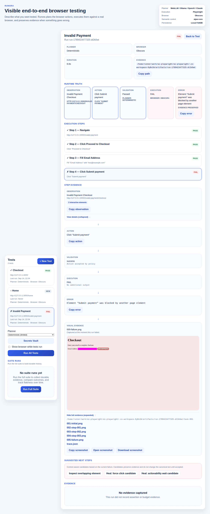
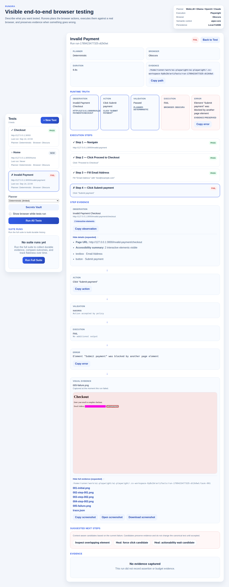
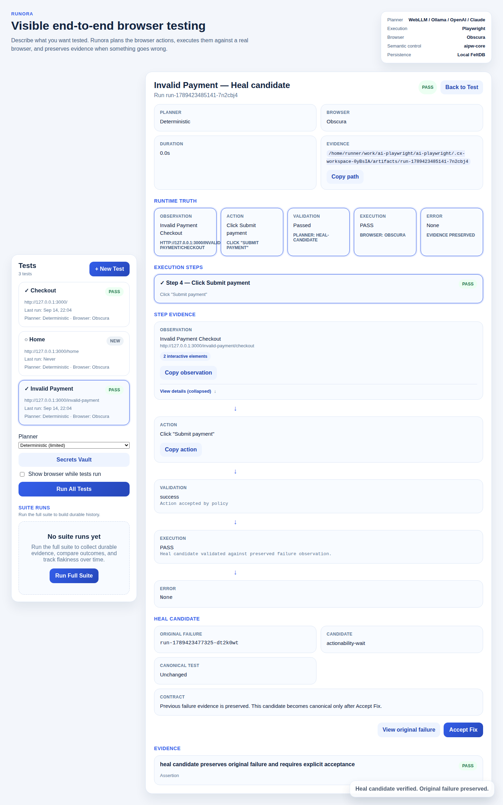
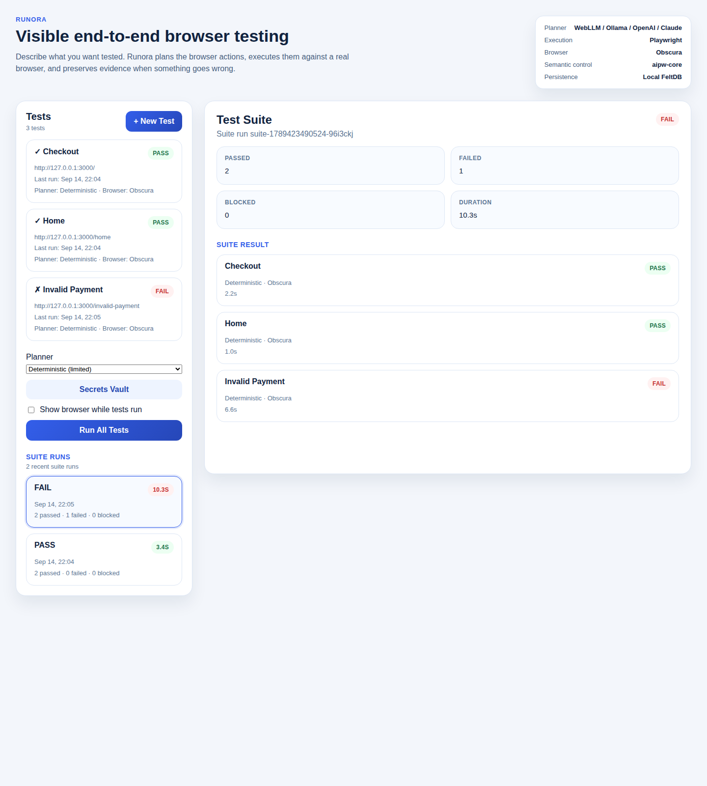
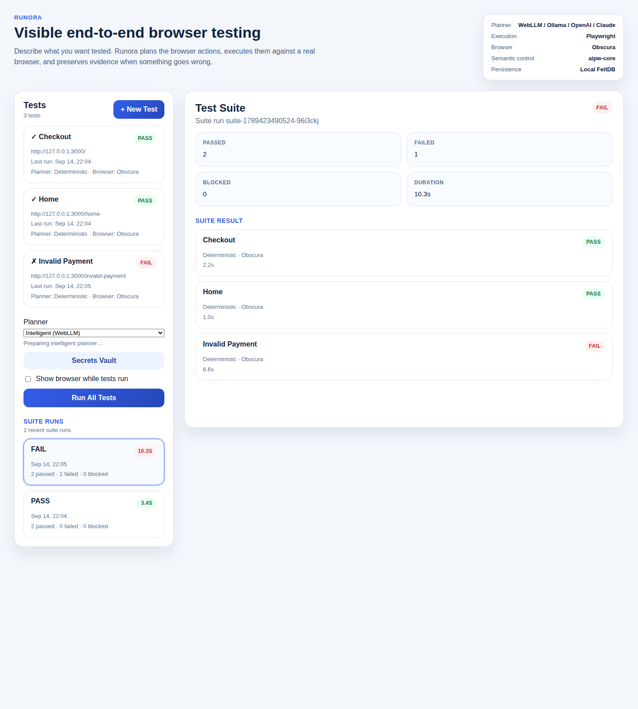
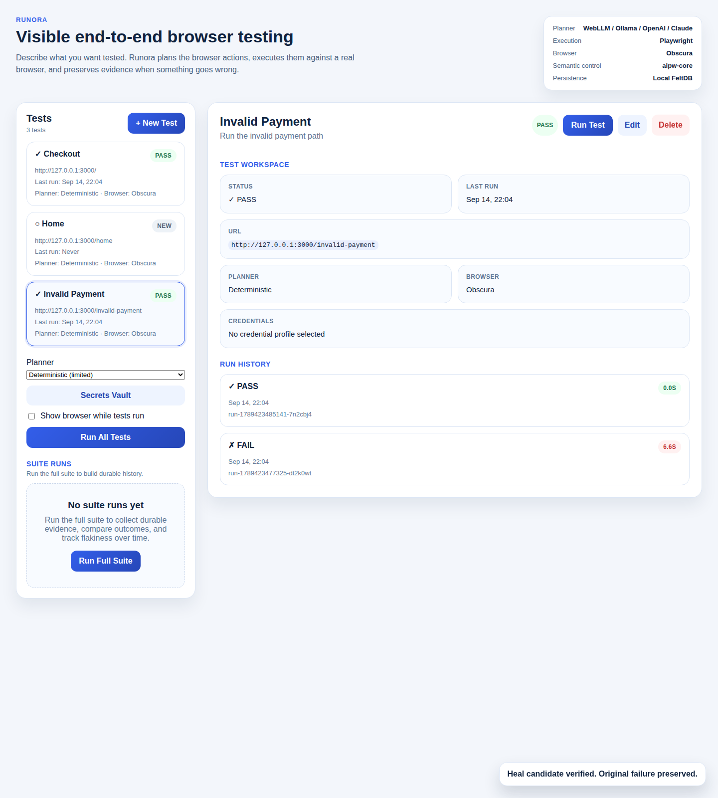

# Runora

Runora is an evidence-first browser testing platform.

Describe what you want verified in plain English. Runora uses AI to understand intent, Playwright executes against a real browser, and every step leaves behind Runtime Truth: what Runora observed, what action it chose, whether that action was valid, what the browser executed, and what happened next.

## Why Runora

Most browser tests end with a red or green result and very little context. Runora keeps the full chain:

Intent  
↓  
AI planning  
↓  
Validated action  
↓  
Real browser execution  
↓  
Runtime Truth  
↓  
Evidence  
↓  
Diagnosis  
↓  
Verification  
↓  
Developer ownership

## Quick Start

### Start inside an existing app

Install Runora, then initialize a workspace in your project:

```bash
npm install runora
npx runora init
```

Some npm versions also expose the published CLI as `npm runora init`. In this
repository, the verified equivalent commands are `npx runora init` and
`npm exec runora init`.

If you prefer to scaffold a fresh project instead of adding Runora to an existing app:

```bash
npm create runora
cd my-runora-project
npx runora init
```

Verified CLI commands in this repository today:

```bash
npx runora init
npx runora test
npx runora test checkout
npx runora ui
npx runora run --planner deterministic --url http://localhost:3000 "Open the app and verify it loads"
```

For scripted setup without opening the workspace UI:

```bash
npx runora init --no-ui --skip-browser-install
```

### What `init` creates

`init` creates a local-first Runora workspace in the current directory:

```text
.
├── runora.config.ts
├── tests/
├── artifacts/
└── .runora/
```

It also appends this to `.gitignore` when needed:

```text
.runora/
artifacts/
```

Default generated config:

```ts
export default {
  url: "http://localhost:3000",
  planner: "webllm",
  headless: true,
  browser: "obscura",
  artifacts: "./artifacts",
  tests: "./tests",
};
```

## The Runora Experience

### 1. Initialize a project

`npx runora init` creates the workspace, ensures Chromium is available, starts the UI on a local port, and opens the browser unless you pass `--no-open`.

### 2. Create and manage tests

Tests live in `tests/` and are discovered from `*.test.ts` and `*.test.js` files.

A Runora test is a small exported object:

```ts
export default {
  id: "checkout",
  name: "Checkout",
  task: "Complete the checkout flow and verify the order succeeds",
  url: "http://127.0.0.1:3000/checkout",
};
```

The workspace UI can create, edit, and delete these files for you. The filesystem stays authoritative.



### 3. Run the test

Runora supports both single-test and suite execution:

```bash
npx runora test checkout
npx runora test
```

In the UI, **Run Test** executes the selected test and **Run Full Suite** executes every discovered test.

Natural-language task  
↓  
Observation  
↓  
Planner  
↓  
BrowserAction  
↓  
Validation  
↓  
Playwright  
↓  
Real browser  
↓  
Fresh observation

The loop is iterative and grounded in actual browser state, not a pre-written script guessed in advance.



### 4. See Runtime Truth

Runora does not only say PASS or FAIL. It records what the system observed, what action it selected, whether policy accepted that action, what the browser executed, and what happened afterward.

Runtime Truth in the current UI is organized around:

- Observation
- Action
- Validation
- Execution
- Error
- Evidence
- Result



### 5. See a passing test

A successful run preserves the same evidence chain. You can inspect step-by-step execution, the final assertion evidence, the planner used, the browser used, duration, and the artifacts directory for that run.


### 6. Understand a failure

Failures stay attached to the exact step that failed. Instead of reducing the run to "test failed," Runora keeps the failure as Runtime Truth.

For the deterministic fixture walkthrough in this repository, the failing example reaches checkout step 4 and records an execution failure when the submit button is blocked by another element.



### 7. Inspect visual evidence

When a screenshot is available, it remains attached to the failing run and step. The current UI can show the failure screenshot inline, highlight the target area, and link to the full stored evidence.



### 8. Expand observation details

Observation cards can be expanded to inspect the current page URL, page title, and the interactive elements Runora observed for that step.



### 9. Diagnose with Suggested Next Steps

Suggested Next Steps are evidence-informed follow-up actions. They are candidates for investigation or remediation; they do not silently rewrite the canonical test.

Current examples in the shipped UI include:

- Inspect overlapping element
- Heal: force click candidate
- Heal: actionability wait candidate
- Re-run with visual debugging
- Draft Playwright promotion candidate
- View full trace


### 10. Heal, verify, and accept

Runora's current ownership loop is explicit:

Failure  
↓  
Suggested fix  
↓  
Heal candidate  
↓  
Candidate validation  
↓  
Developer accepts  
↓  
Canonical test updated  
↓  
Deterministic verification run recorded

A heal attempt preserves the original failure. A candidate does not become the canonical test until you explicitly click **Accept Fix**.



### 11. Run the suite

`npx runora test` runs every discovered test as a suite and persists aggregate results.

Current suite aggregation is:

- any failed test → FAIL
- otherwise any blocked test → BLOCKED
- otherwise → PASS



### 12. Review history

Run history and suite history persist under the workspace artifacts directory and are reloaded when the UI restarts. A failure becomes an inspectable artifact instead of a terminal process message.

The suite history summary currently surfaces recent failure frequency as text such as `Failed 2 of last 5 runs`.





## Runtime Truth

Runtime Truth is the product contract behind every run.

For each step, Runora preserves:

- the page observation it planned from
- the action it chose
- whether validation accepted or rejected that action
- the Playwright execution result
- the resulting error, if any
- assertion evidence and artifacts

That makes a run inspectable after the browser has closed and after the UI has restarted.

## Failure Diagnosis

Failures are categorized from the recorded run result into phases such as:

- planning
- validation
- execution
- assertion
- runtime

The current failure UI highlights the failed step, shows the browser error, and keeps the observation and action that led to it.

## Healing and Verification

Shipped today:

- heal candidates derived from failed evidence
- explicit acceptance before mutating the canonical test
- verification lineage recorded with the run

Not shipped today:

- side-by-side evidence comparison UI
- arbitrary step-level rerun UI

## Playwright Ownership

Runora already executes browser actions through Playwright today.

Shipped today:

- Playwright execution as the runtime executor
- explicit Suggested Next Steps text for drafting a Playwright promotion candidate
- deterministic planner mode for repeatable non-WebLLM runs

Not shipped today:

- a dedicated UI that generates, previews, and accepts Playwright code promotion

## Suites and History

Shipped today:

- discovery of tests from `tests/*.test.ts` and `tests/*.test.js`
- individual test runs
- full suite runs
- persisted per-test run history
- persisted suite history
- recent-suite failure frequency summary in the UI

## Planner Modes

Runora supports these planner modes today:

- `webllm` — default workspace planner; inference runs in the browser UI
- `ollama` — local HTTP model discovery and execution through Ollama
- `openai`
- `anthropic`
- `deterministic` — explicit limited planner for stable fixture and ownership-loop flows

Important current behavior:

- `runora.config.ts` defaults to `webllm`
- the workspace UI can select planner providers
- the one-shot `run` command is for deterministic terminal workflows; intelligent WebLLM runs belong in the browser workspace started by `npx runora init`

## Configuration

Workspace configuration is local to the current project:

```ts
export default {
  url: "http://127.0.0.1:3000",
  planner: "webllm",
  model: {
    provider: "webllm",
    model: "Llama-3.2-1B-Instruct-q4f16_1-MLC",
  },
  headless: true,
  browser: "obscura",
  artifacts: "./artifacts",
  tests: "./tests",
};
```

## See the complete experience

These screenshots come from the real Runora workspace against the deterministic checkout fixture in this repository.

1. 
2. 
3. 
4. 
5. 
6. 
7. 
8. 
9. 
10. 
11. 
12. 

For the reproducible capture procedure, see [`docs/CX-SCREENSHOTS.md`](./docs/CX-SCREENSHOTS.md).

## Architecture

```text
Runora CLI / UI
       ↓
Workspace
       ↓
Runner
       ↓
Planner Adapter
       ↓
aipw-core
       ↓
Playwright Browser Executor
       ↓
Obscura / Browser
```

Semantic control loop:

```text
Observation
   ↓
Action
   ↓
Validation
   ↓
Execution
   ↓
Observation
```

The kernel owns the semantic control loop. Runtime-specific concerns such as browser launch, storage, and UI live outside that kernel.

## Local-First / Privacy

- WebLLM planning stays in the browser workspace
- run history, suite history, and secret profiles stay in the local workspace
- credentials are stored under `.runora/` and encrypted with AES-256-GCM
- Playwright artifacts remain on disk under `artifacts/`

## Current Status

### Shipped

- workspace initialization and UI
- plain-English test definitions
- single-test and suite execution
- Runtime Truth inspection
- persisted run and suite history
- screenshot and trace evidence
- Suggested Next Steps
- heal candidates with explicit acceptance
- deterministic planner mode
- provider-backed planner selection in the workspace

### Experimental

- browser-local WebLLM setup and model download experience
- provider model discovery flows for Ollama, OpenAI, and Claude
- real-runtime acceptance that depends on local Obscura and WebLLM support

### Future

- explicit Playwright code promotion UI
- step-level rerun and evidence comparison UI
- richer flakiness analysis than recent-suite failure counts

## Development

Repository validation:

```bash
npm test
npm run build
npm run web:build
```

Regenerate the README screenshot set from the real product:

```bash
AIPW_UPDATE_CX_SCREENSHOTS=1 npm test -- tests/e2e/cx-workspace.e2e.ts
```

Run the real WebLLM acceptance path when your environment supports it:

```bash
AIPW_REAL_WEBLLM=1 AIPW_WEBLLM_MODEL=Llama-3.2-1B-Instruct-q4f16_1-MLC npm test -- tests/e2e/real-runtime.e2e.ts
```
