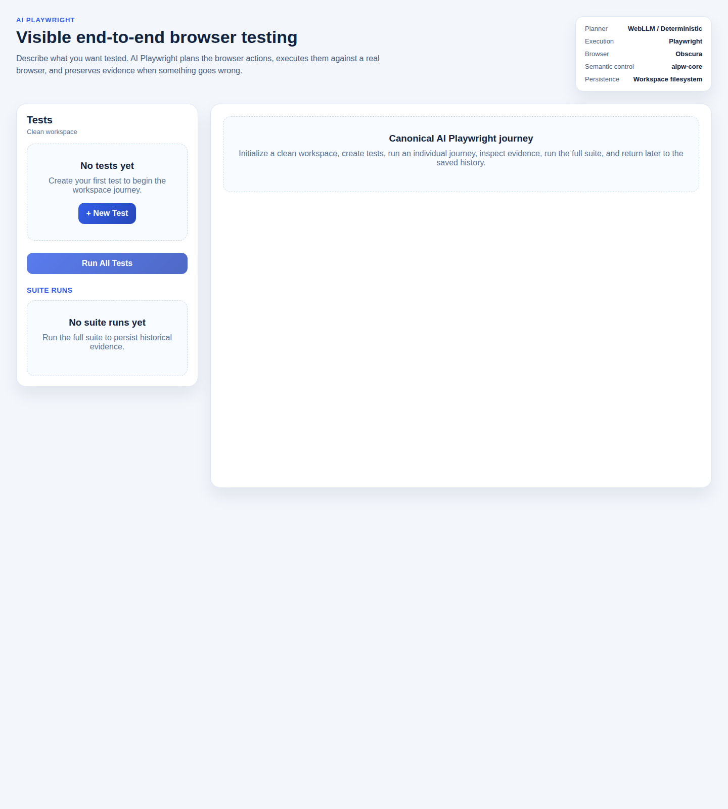
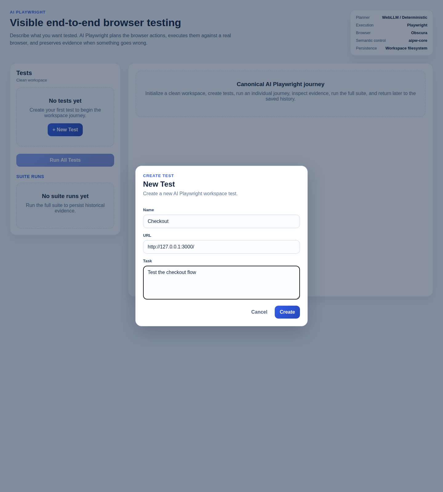
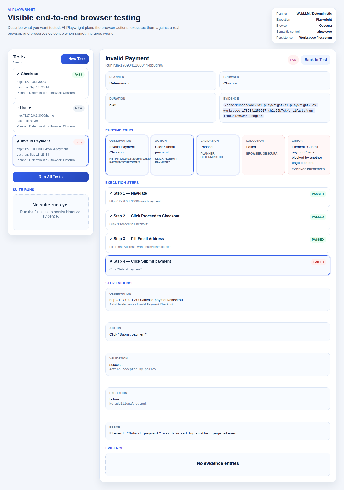
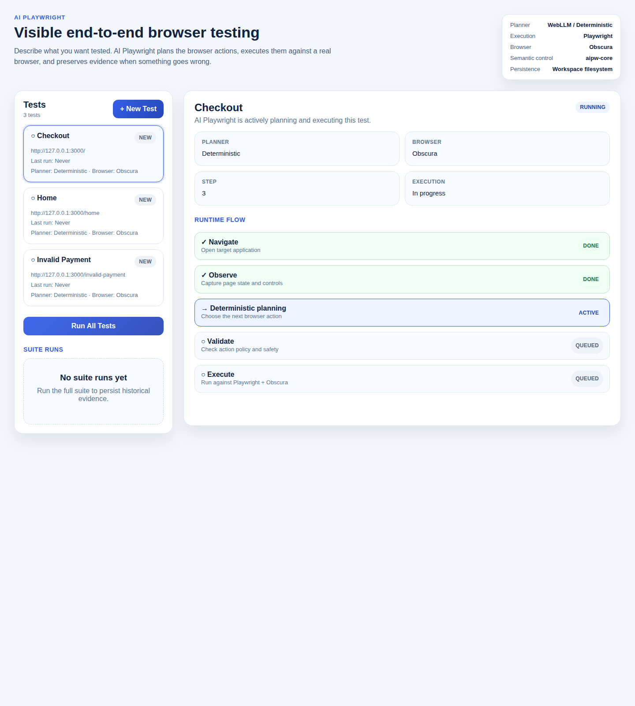
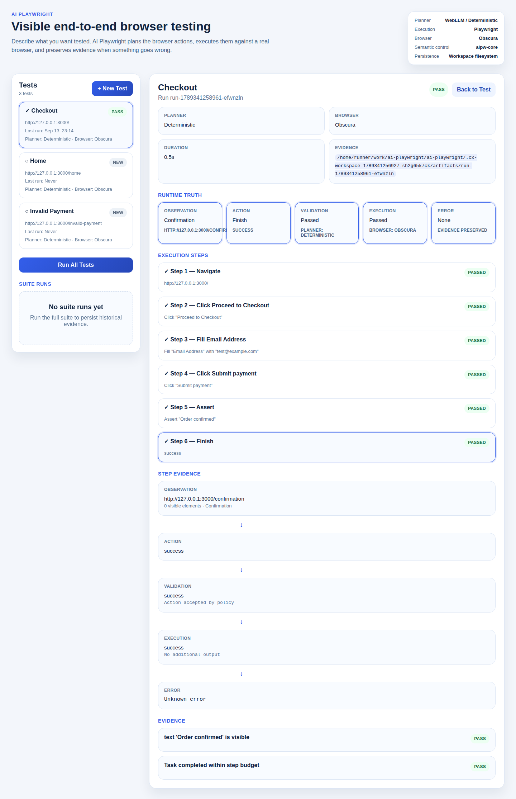
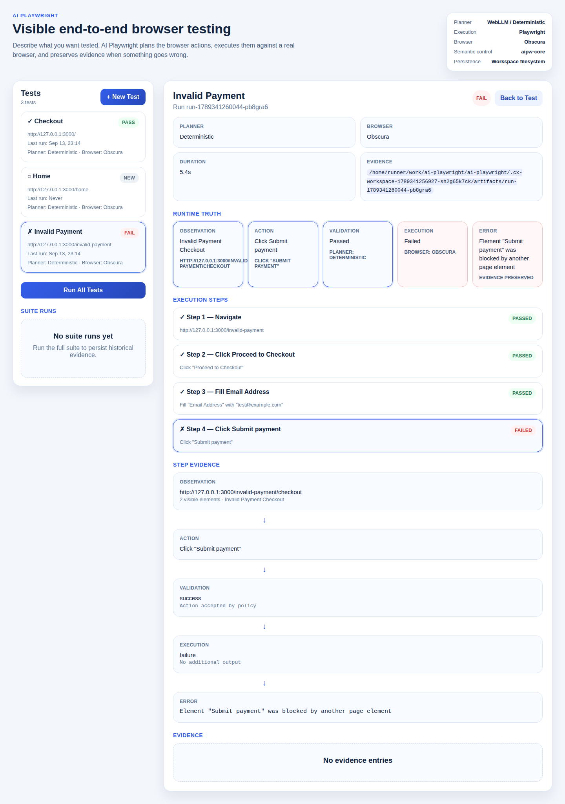
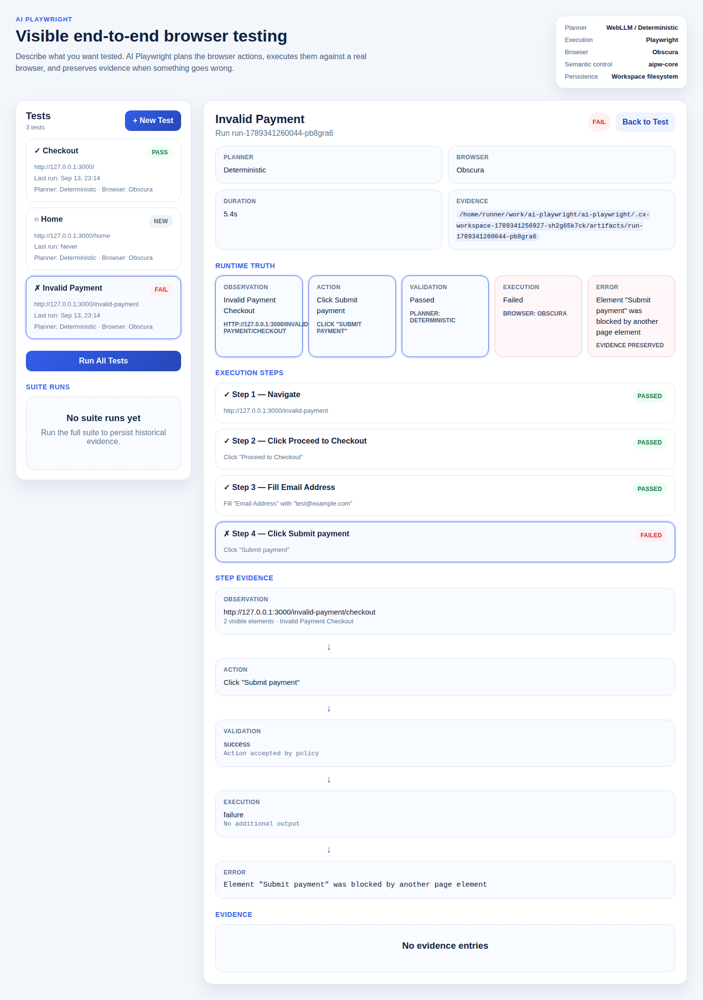
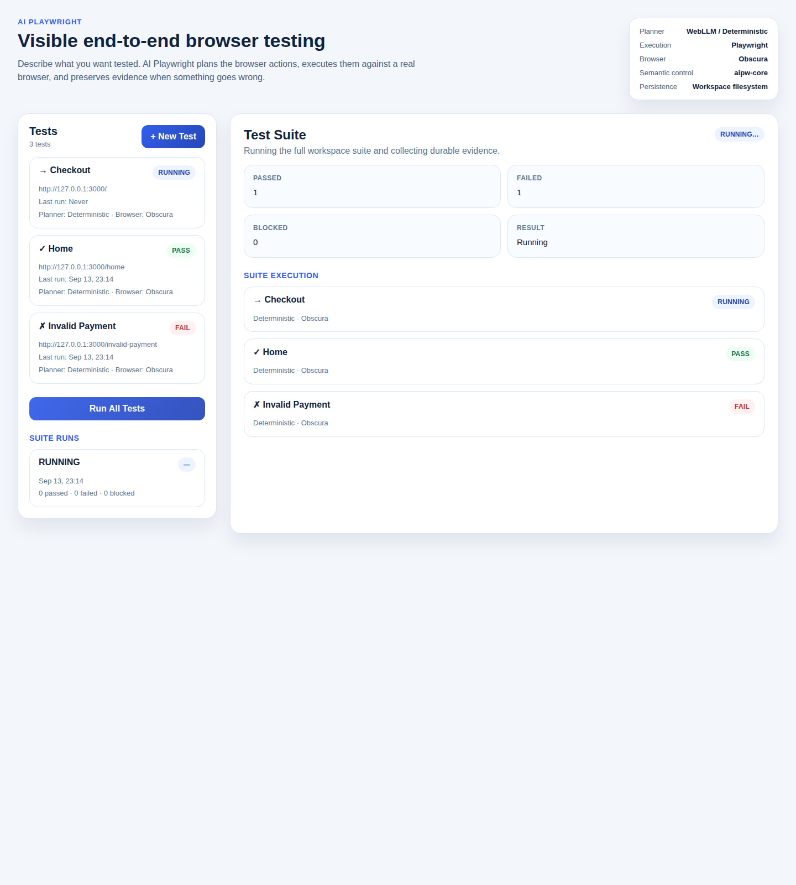
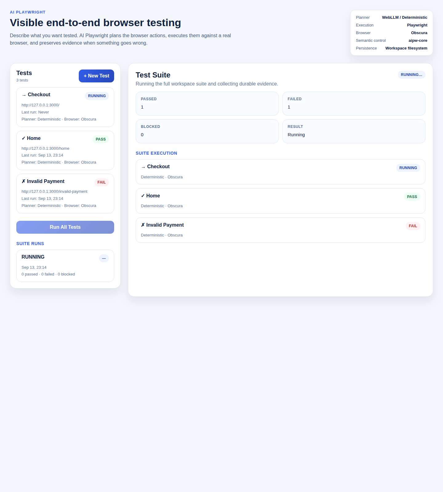
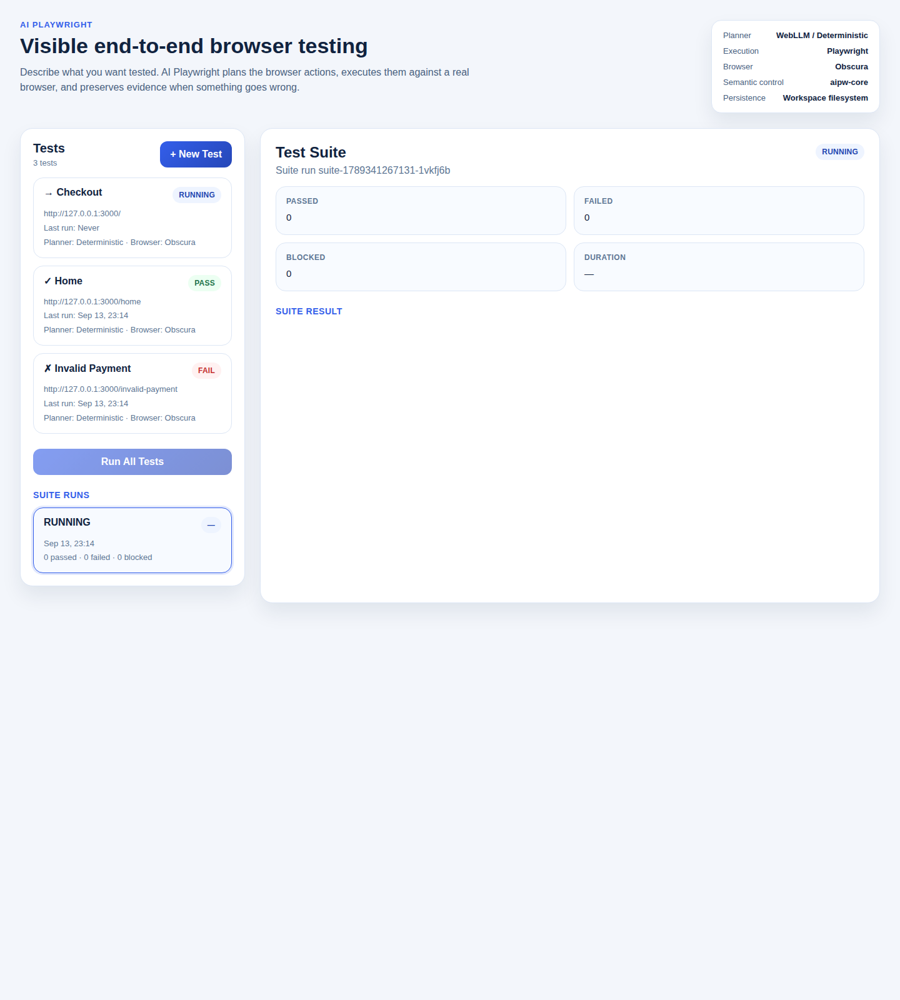

# AI Playwright CX Walkthrough

This is the canonical AI Playwright journey from a clean workspace to durable suite history.

Canonical app:

- Checkout Demo
- `http://127.0.0.1:3000`

Canonical tests:

- Checkout
- Invalid Payment
- Home

The screenshots in this document come from the real workspace UI and the real workspace runner against a deterministic local fixture app so the states are stable and reproducible.

Runtime truth:

- Planner: WebLLM in real runtime mode, deterministic planner in this reproducible fixture walkthrough
- Execution: Playwright
- Browser: Obscura
- Semantic control: `aipw-core`
- Persistence: workspace filesystem

The developer describes what they want tested. AI Playwright plans browser actions, executes them against a real browser, and preserves evidence when something goes wrong.

## 1. Install

- User action: install dependencies and browser prerequisites, then install or make Obscura available.
- Screenshot: none
- What the user sees: a ready local environment for `init` and `ui`.
- What the system is doing: preparing Playwright, Obscura, and the local workspace runtime.
- Expected result: the repository is ready to initialize a workspace.

## 2. Initialize workspace

- User action:

  ```bash
  npx ai-playwright init
  ```

- Screenshot: 
- What the user sees: AI Playwright opens on a clean workspace with no saved tests yet and one obvious first action.
- What the system is doing: creating `ai-playwright.config.ts`, `tests/`, and `artifacts/` in the workspace.
- Expected result: the workspace exists and is ready for test authoring.

## 3. Open UI

- User action:

  ```bash
  npx ai-playwright ui
  ```

- Screenshot: 
- What the user sees: the workspace UI with the Tests panel, empty state, and suite history area.
- What the system is doing: serving the workspace UI and reading persisted tests and run history from disk.
- Expected result: the developer can create and inspect tests without leaving the browser.

## 4. Create test

- User action: click **+ New Test** and fill in the first test.
- Screenshot: 
- What the user sees: a real form for name, URL, and task.
- What the system is doing: preparing a filesystem-backed workspace test definition.
- Expected result: clicking **Create** writes a new `.test.ts` file for the Checkout journey.

## 5. Create additional tests

- User action: add **Invalid Payment** and **Home** through the same form.
- Screenshot: 
- What the user sees: the workspace list now shows multiple tests, their URLs, last-run status, and run controls.
- What the system is doing: persisting each test definition in the workspace and reloading the test list from disk.
- Expected result: the workspace is ready to run one test or the entire suite.

## 6. Run individual test

- User action: open **Checkout** and click **Run Test**.
- Screenshot: 
- What the user sees: a live running state instead of a static result.
- What the system is doing: navigating to the app, observing page state, planning the next action, validating that action, and executing it in the browser.
- Expected result: the developer can tell the product is actively working on the requested journey.

## 7. Observe WebLLM + Obscura

- User action: inspect the runtime panel while a run is active and while viewing a saved run.
- Screenshot: 
- What the user sees: planner, browser, execution, semantic control, and persistence surfaced as runtime truth.
- What the system is doing: exposing the provenance of planning and execution without making the user understand internal architecture first.
- Expected result: the experience stays product-first while still making the runtime honest and inspectable.

## 8. Inspect PASS

- User action: wait for **Checkout** to finish and inspect the resulting run.
- Screenshot: 
- What the user sees: PASS, preserved evidence, execution steps, and the saved run record.
- What the system is doing: storing run metadata, evidence, and step-by-step trace information under the workspace artifacts directory.
- Expected result: the developer can prove what happened on a successful run.

## 9. Run deliberately failing test

- User action: open **Invalid Payment** and click **Run Test**.
- Screenshot: 
- What the user sees: FAIL, the failed step, and the failing browser action.
- What the system is doing: executing the same real runtime path, then stopping as soon as the browser action fails.
- Expected result: the developer gets a concrete failed run instead of a vague red state.

## 10. Diagnose failure

- User action: select the failed step.
- Screenshot: 
- What the user sees: Observation ↓ Action ↓ Validation ↓ Execution ↓ Error.
- What the system is doing: reading the persisted run trace and exposing the exact failure evidence chain.
- Expected result: the developer can understand why the run failed, not just that it failed.

## 11. Run entire suite

- User action: click **Run All Tests**.
- Screenshot: 
- What the user sees: a running suite view with the three canonical tests and aggregate progress.
- What the system is doing: executing each saved test sequentially and aggregating suite status as results arrive.
- Expected result: the workspace can run the complete product scenario, not just isolated tests.

## 12. Inspect suite result

- User action: wait for the suite to finish.
- Screenshot: 
- What the user sees: suite FAIL with `2` passed, `1` failed, and clickable run results for each test.
- What the system is doing: persisting suite-level aggregation alongside the underlying individual run evidence.
- Expected result: the developer can see the whole workspace state at a glance and drill down where needed.

## 13. Inspect suite history

- User action: open a saved suite run from the history list.
- Screenshot: 
- What the user sees: historical suite entries and a drill-in view for a previously failed suite run.
- What the system is doing: loading persisted `suite-*.json` history from the workspace artifacts directory.
- Expected result: the workspace proves durable evidence, not just the current in-memory process state.

## 14. Restart UI

- User action: stop the UI server and start it again with `npx ai-playwright ui`.
- Screenshot: 
- What the user sees: the same workspace can be reopened without recreating tests or rerunning history.
- What the system is doing: rehydrating the UI from filesystem-backed tests and suite-run records.
- Expected result: the experience survives process restarts.

## 15. Verify history remains

- User action: reopen the workspace and inspect suite history again.
- Screenshot: 
- What the user sees: the previously saved suite history is still present.
- What the system is doing: reading persisted suite runs after restart instead of reconstructing state from memory.
- Expected result: the developer can come back later and still inspect the same PASS/FAIL evidence.

## Acceptance proof in this repository

- Product-level acceptance test: `AIPW_RUN_CX_WORKSPACE=1 npm test -- tests/e2e/cx-workspace.e2e.ts`
- Real WebLLM acceptance path: `tests/e2e/real-runtime.e2e.ts`
- Screenshot directory: `docs/images/cx/`

The walkthrough is complete when someone unfamiliar with the repository can scan the screenshots above and understand the full path from “I have a web app I want to test” to “AI Playwright ran the browser flow, surfaced the failure, and saved the evidence.”
